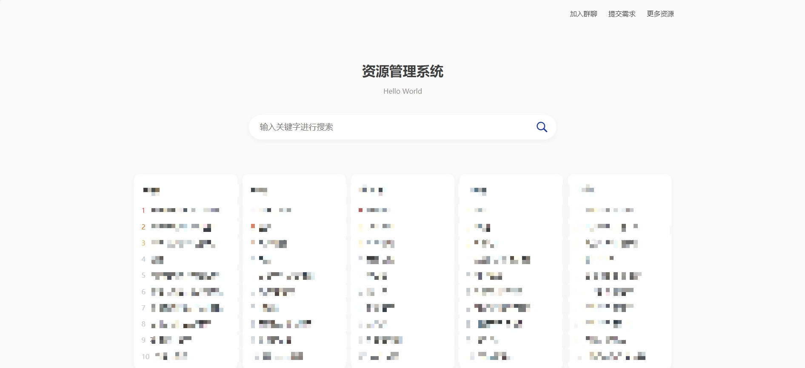
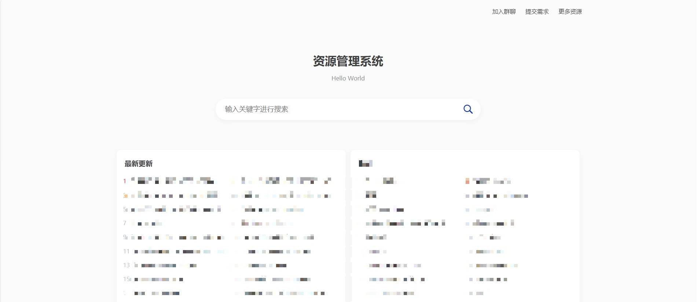
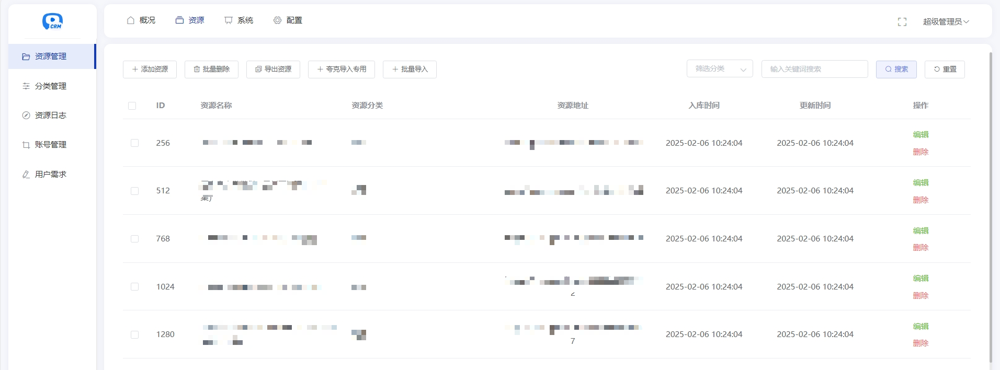
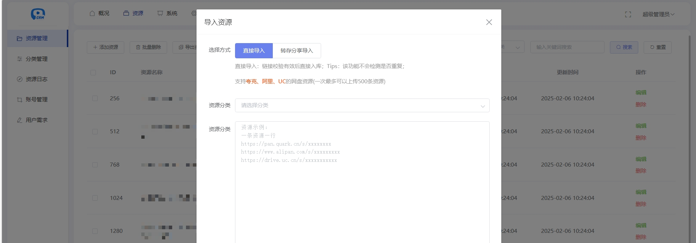

# Pan Resource Manager

一个基于 ThinkPHP 6 的网盘资源整理、搜索与后台管理系统。项目用于管理用户自行配置的资源信息和第三方搜索源，不存储网盘文件本身。

## 主要功能

- 资源展示：分类浏览、关键词搜索、详情页、排行榜和用户反馈。
- 资源管理：新增、编辑、批量导入、分类管理、日志和失效资源处理。
- 多网盘处理：夸克、百度、阿里云盘、UC 和迅雷等网盘的转存或分享流程。
- 全网搜索：支持 API、TG 频道和网页采集等可配置搜索源，可设置优先级和屏蔽关键词。
- 后台管理：管理员、用户组、菜单权限、附件、基础参数及搜索线路配置。
- 站点设置：SEO、首页展示方式、主题样式及部分第三方服务参数。

具体能力取决于后台配置、第三方接口状态以及各网盘平台的可用性。

## 技术栈

- PHP 7.2.5 或更高版本（已兼容 PHP 8.0/8.3）
- ThinkPHP 6.1.4
- MySQL 5.7+ 或 MySQL 8.0
- Vue 2、Element UI（后台页面，静态资源已包含在项目中）

建议启用以下 PHP 扩展：

- `pdo_mysql`
- `mysqli`（网页安装器需要）
- `curl`
- `mbstring`
- `fileinfo`
- `openssl`

## 目录说明

```text
app/            应用代码
config/         ThinkPHP 配置
extend/         网盘及其他扩展
public/         Web 根目录、静态资源和安装程序
route/          路由配置
runtime/        运行缓存与日志（不会提交到 Git）
vendor/         已包含的 PHP 依赖
think           ThinkPHP 命令行入口
```

## 安装部署

### 1. 准备环境

创建一个空的 MySQL 数据库，并确保 PHP 进程可以写入以下位置：

- `runtime/`
- `public/uploads/`
- 项目根目录（安装器需要生成 `.env`）
- `public/install/`（安装器需要生成 `install.lock`）

生产环境必须将网站运行目录指向 `public/`，不要直接暴露项目根目录。

### 2. 使用网页安装器

首次部署时访问网站首页，程序会自动跳转到安装界面。依次完成：

1. 环境和目录权限检测。
2. 填写 MySQL 地址、端口、数据库名、用户名和密码。
3. 保留默认数据表前缀 `qf_`，或按需修改。
4. 设置网站名称和后台管理员账号。
5. 等待数据表导入完成。

安装完成后会生成 `public/install/install.lock`。请保留该文件，并确认外部无法再次打开安装流程。

后台登录地址：

```text
/qfadmin
```

### 3. 本地开发

```bash
php think run -H 0.0.0.0 -p 8000
```

如果当前 PHP 环境无法通过 `think run` 启动，也可以直接使用 PHP 内置服务器：

```bash
php -S 0.0.0.0:8000 -t public public/router.php
```

然后访问 `http://127.0.0.1:8000`。

## 环境配置

数据库配置保存在根目录 `.env` 中。示例：

```ini
APP_DEBUG = false

[APP]
DEFAULT_TIMEZONE = Asia/Shanghai

[DATABASE]
TYPE = mysql
HOSTNAME = 127.0.0.1
DATABASE = your_database
USERNAME = your_username
PASSWORD = your_password
HOSTPORT = 3306
CHARSET = utf8mb4
PREFIX = qf_
```

`.env`、运行日志和网盘令牌文件已加入 `.gitignore`，不要将数据库密码、Cookie、访问令牌等敏感信息提交到仓库。

## 项目截图

### 前台界面





### 后台管理





## 使用说明

- 项目不附带第三方资源采集源、网盘账号、Cookie 或访问令牌，需要在后台自行配置。
- 网盘接口和第三方搜索源可能随平台规则变化而失效，部署者需要自行维护相关配置。
- 正式上线前请关闭调试模式，使用独立数据库账号，并限制 `runtime/`、`.env` 和安装目录的外部访问。
- 请定期备份数据库，并及时清理失效资源和运行日志。

## 法律声明

本项目仅用于技术学习和合法的信息管理场景：

1. 项目不存储、不提供任何网盘资源文件或下载内容。
2. 使用者应确保录入、展示和分享的信息具备合法来源及必要授权。
3. 禁止将本项目用于侵犯版权、传播违法内容或其他违反当地法律法规的活动。
4. 因部署、配置或使用本项目产生的风险和责任由使用者自行承担。
