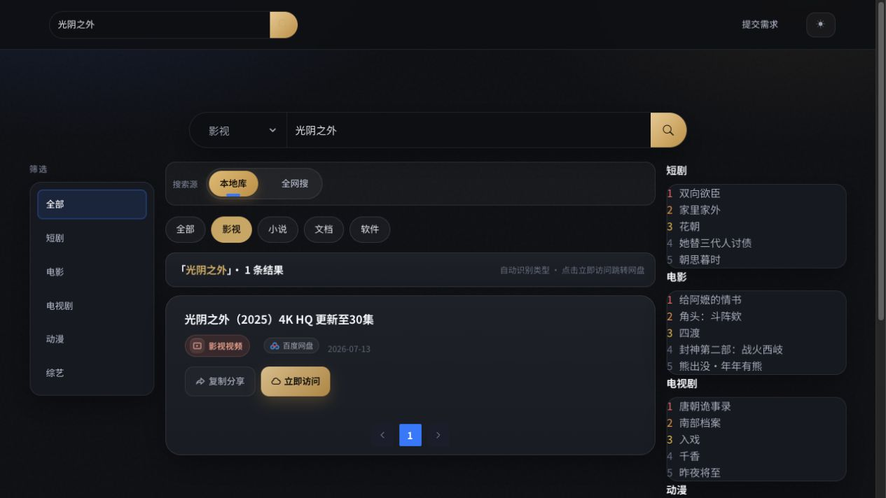
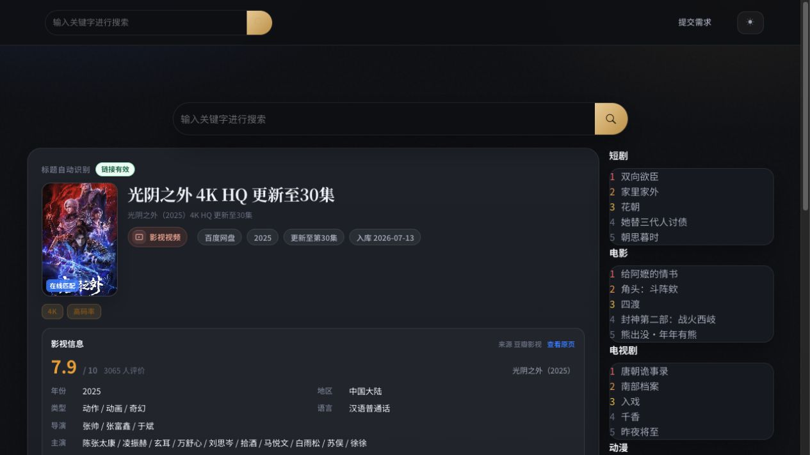
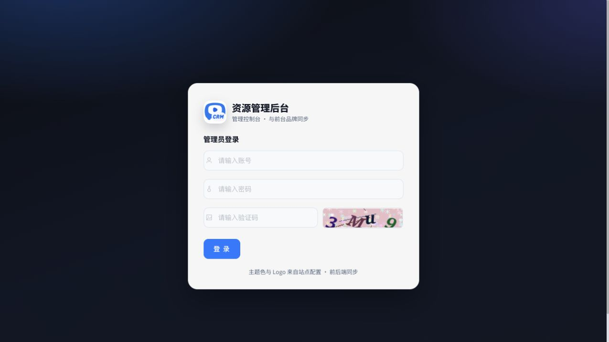

# Pan Resource Manager

Pan Resource Manager 是一个基于 ThinkPHP 6 的网盘资源整理、分类搜索、详情展示和后台管理系统。它用于管理站长自行录入或通过已配置搜索源获得的资源信息，不保存网盘文件本身。

系统同时支持本地资源库与全网搜索，可按影视、小说、文档、软件等类型筛选。搜索结果会预热资源详情，在详情页展示与资源类型匹配的海报、简介、年份、评分和规格等信息。

## 运行界面

### 首页

首页提供统一搜索入口和资源类型选择，可直接指定影视、小说、文档或软件。


### 分类搜索

搜索页支持本地库与全网搜索切换，并保留类型、分类和关键词条件。系统会在搜索阶段预热资源详情和海报，减少进入详情页后的等待时间。



### 资源详情

详情页展示资源标题、网盘类型、链接状态、规格、公开资料和资源地址。影视与小说等不同类型使用各自的元数据识别逻辑，避免混用海报和简介。



### 管理后台

后台登录页支持账号、密码和图形验证码。站点名称、Logo 与主题信息可跟随后台配置显示。



## 主要功能

| 模块 | 说明 |
| --- | --- |
| 首页搜索 | 支持关键词与资源类型组合搜索，并保留移动端适配 |
| 本地资源库 | 分类浏览、分页、关键词搜索、类型筛选和资源详情 |
| 全网搜索 | 接入后台配置的 API、TG 频道或网页采集源，按优先级聚合结果 |
| 类型识别 | 根据分类、标题、扩展名和资源信息识别影视、小说、文档、软件等类型 |
| 详情预热 | 搜索阶段提前获取资源详情、链接状态、海报和公开资料 |
| 元数据展示 | 影视可展示年份、地区、类型、评分、主创和简介等公开信息 |
| 海报缓存 | 将允许来源的海报缓存到本地，降低第三方图片失效和跨域影响 |
| 链接检测 | 只读检查资源链接可用性；单次检测失败不会直接禁用数据库记录 |
| 网盘支持 | 兼容夸克、百度、阿里云盘、UC、迅雷等网盘的分享或转存流程 |
| 后台管理 | 资源、分类、搜索线路、用户组、菜单权限、附件、日志和基础参数管理 |
| 站点设置 | 网站名称、Logo、SEO、首页展示、主题样式及部分第三方服务参数 |

实际可用能力取决于后台配置、第三方接口状态和各网盘平台规则。

## 搜索与详情流程

```text
用户输入关键词并选择类型
        ↓
查询本地资源库或已配置的全网搜索源
        ↓
按影视 / 小说 / 文档 / 软件过滤结果
        ↓
后台预热链接状态、公开资料与海报
        ↓
展示搜索结果并缓存可复用的详情信息
        ↓
进入详情页查看资源信息和网盘入口
```

需要注意：

- 系统只管理资源信息，不读取或保存网盘文件内容。
- 公开元数据与海报只用于辅助展示，网盘标题和资源地址仍是资源记录的主体。
- 详情预热与链接检测均为只读操作，不会自动转存或修改用户网盘。
- 第三方元数据暂时不可用时，页面会保留资源本身信息，不会把影视海报套用到小说或文档。

## 技术栈

- PHP 7.2.5 或更高版本，已适配 PHP 8.0 和 PHP 8.3
- ThinkPHP 6.1.4
- MySQL 5.7+ 或 MySQL 8.0
- Vue 2、Element UI（后台页面，静态资源已包含）
- 原生 JavaScript 与响应式 CSS（前台页面）

建议启用以下 PHP 扩展：

- `pdo_mysql`
- `mysqli`（网页安装器需要）
- `curl`
- `mbstring`
- `fileinfo`
- `openssl`

## 目录说明

```text
app/                 应用、控制器、模型和公共业务逻辑
config/              ThinkPHP 配置
docs/screenshots/    README 使用的真实运行截图
extend/              网盘及其他扩展
public/              Web 根目录、前后台静态资源和安装程序
route/               路由配置
runtime/             运行缓存、日志和海报缓存，不提交到 Git
scripts/             本地开发辅助脚本
vendor/              已包含的 PHP 依赖
think                ThinkPHP 命令行入口
```

## 快速开始

### 1. 环境准备

创建一个空的 MySQL 数据库，并确认 PHP 进程可以写入：

- `runtime/`
- `public/uploads/`
- 项目根目录（安装器需要生成 `.env`）
- `public/install/`（安装器需要生成 `install.lock`）

生产环境必须将网站运行目录指向 `public/`，不要直接暴露项目根目录。

### 2. 网页安装

首次部署时访问网站首页，程序会自动跳转到安装界面：

1. 完成环境和目录权限检测。
2. 填写 MySQL 地址、端口、数据库名、用户名和密码。
3. 保留默认数据表前缀 `qf_`，或根据部署要求修改。
4. 设置网站名称和后台管理员账号。
5. 等待数据表导入完成。

安装完成后会生成 `public/install/install.lock`。请保留该文件，避免安装程序被再次访问。

后台入口：

```text
/qfadmin
```

### 3. 本地运行

推荐使用项目自带脚本：

```bash
./scripts/dev-server.sh
```

默认访问地址：

```text
http://127.0.0.1:8000
```

脚本会优先选择 PHP 8.3，并拒绝当前不兼容的 PHP 8.4/8.5。需要指定 PHP 时：

```bash
PHP_BIN=/path/to/php8.3 ./scripts/dev-server.sh
```

也可以手动启动：

```bash
/opt/homebrew/opt/php@8.3/bin/php -S 0.0.0.0:8000 -t public public/router.php
```

## 环境配置

数据库配置保存在项目根目录 `.env`：

```ini
APP_DEBUG = false

[APP]
DEFAULT_TIMEZONE = Asia/Shanghai

[DATABASE]
TYPE = mysql
HOSTNAME = 127.0.0.1
DATABASE = your_database
USERNAME = your_username
PASSWORD = your_password
HOSTPORT = 3306
CHARSET = utf8mb4
PREFIX = qf_
```

`.env`、运行日志、海报缓存和网盘令牌文件已加入 `.gitignore`。不要提交数据库密码、Cookie、访问令牌或其他敏感信息。

## 后台配置建议

安装完成后建议依次完成：

1. 在站点设置中配置网站名称、Logo、SEO 和前台展示方式。
2. 创建资源分类，并明确分类对应的影视、小说、文档或软件类型。
3. 配置本地资源数据或合法可用的第三方搜索线路。
4. 按需配置网盘参数；Cookie 和令牌只保存在部署环境中。
5. 使用前台搜索验证类型过滤、详情预热、海报展示和网盘跳转。
6. 正式上线前关闭调试模式，并复查文件权限和敏感配置。

## 生产部署

- Web 根目录必须指向 `public/`。
- 推荐使用 Nginx 或 Apache，并启用 HTTPS。
- PHP 生产环境推荐使用 PHP 8.3 与 PHP-FPM。
- 确认 `runtime/` 可写，但不能被外部直接访问。
- 禁止通过 Web 访问 `.env`、数据库备份、日志和令牌文件。
- 为数据库使用独立低权限账号，并定期备份数据库。
- 第三方搜索源和网盘接口可能变化，需要定期检查可用性。

## 常见问题

### 页面提示 `could not find driver`

PHP 缺少 MySQL PDO 扩展。确认以下命令能看到 `pdo_mysql`：

```bash
php -m | grep -Ei 'PDO|mysql'
```

### 页面提示数据库 `Connection refused`

检查 `.env` 中的数据库主机、端口、账号和密码，并确认 MySQL 服务可以从 PHP 所在环境访问。

### 端口 8000 被占用

停止旧的开发服务器，或使用其他端口：

```bash
PORT=8001 ./scripts/dev-server.sh
```

### 海报或公开资料未显示

资源本身仍可正常使用。请检查服务器网络、PHP `curl` 与 `openssl` 扩展，以及第三方公开数据源是否可访问。系统不会为了补图而混用其他资源类型的海报。

## 使用与安全说明

- 项目不附带第三方资源采集源、网盘账号、Cookie 或访问令牌，需要部署者自行合法配置。
- 不要把真实 Cookie、数据库文件、`.env`、日志或用户数据上传到公开仓库。
- 正式上线前请关闭调试模式，限制安装目录访问，并启用 HTTPS。
- 定期备份数据库，清理失效资源、过期缓存和运行日志。
- 对外提供搜索功能时，应限制请求频率并遵守第三方服务规则。

## 法律声明

本项目仅用于技术学习和合法的信息管理场景：

1. 项目不存储、不提供任何网盘资源文件或下载内容。
2. 使用者应确保录入、展示和分享的信息具备合法来源及必要授权。
3. 禁止将本项目用于侵犯版权、传播违法内容或其他违反当地法律法规的活动。
4. 因部署、配置或使用本项目产生的风险和责任由使用者自行承担。
